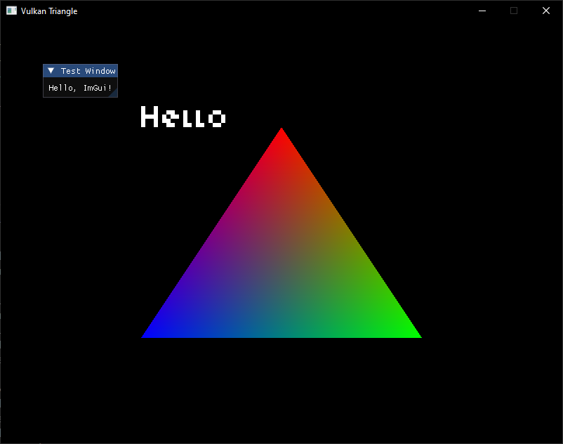

# sdl3_vulkan_module_c_cpp

# Licenses: MIT

# Required:
 * CMake
 * VS2022 c/c++

# Information:
  
  Simple triangle test, render text "hello" and cimgui for graphic user interface.

  Using the c as base and c++ wrapper for c to handle and help c build api with minimal.

# Goal:
  To create module design for 3D world build test. To build the module for SDL3 and Vulkan module as well some libraries.

# Image:


# Project:
```
fonts
-Kenney Mini.ttf
include
- vsdl_cleanup.h
- vsdl_init.h
- vsdl_mesh.h
- vsdl_pipeline.h
- vsdl_renderer.h
- vsdl_text.h
- vsdl_types.h
- vsdl_utils.h
shaders
- shader2d.frag
- shader2d.vert
- text.frag
- text.vert
src
- main.c
- vma_impl.cpp
- vsdl_cleanup.c
- vsdl_init.c
- vsdl_mesh.c
- vsdl_pipeline.c
- vsdl_renderer.c
- vsdl_text.c
- vsdl_utils.c
CMakeLists.txt
```

# Features:
 * cimgui
 * triangle
 * render text

  Need to add some features.


# Libraries using c++:
 * VulkanMemoryAllocator

  Using the VulkanMemoryAllocator. https://github.com/GPUOpen-LibrariesAndSDKs/VulkanMemoryAllocator

  Reason a lot of boilerplate code.


# Libraries:
 * SDL (added)
 * volk (remove)
 * VulkanHeaders (added)
 * VulkanMemoryAllocator (added)
 * mimalloc (not added)
 * freetype (not added)
 * cglm (not added)
 * assimp (not added)
 * 
 * 

## github:
 * https://github.com/libsdl-org/SDL
 * https://github.com/zeux/volk
 * https://github.com/KhronosGroup/Vulkan-Headers
 * https://github.com/GPUOpen-LibrariesAndSDKs/VulkanMemoryAllocator
 * https://github.com/microsoft/mimalloc
 * https://github.com/freetype/freetype
 * https://github.com/recp/cglm
 * https://github.com/assimp/assimp
 * 
 * 

# Credits:
 * https://vulkan-tutorial.com
 * https://kenney.nl/assets/kenney-fonts 
 * 